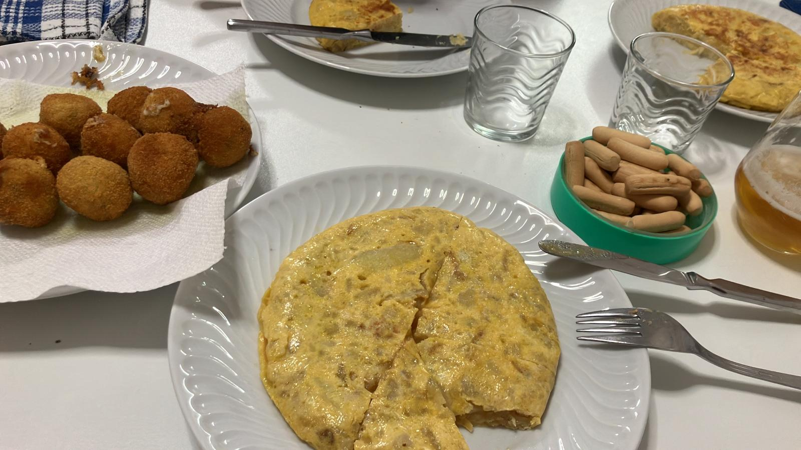

    
    <figcaption>
Crédito: Alfonso Aguilar Pontes
</figcaption>

<h1 align="center">La tortilla española con o sin cebolla</h1>

<h4 align="center">Según el CIS el 70,4 % de los españoles prefieren la tortilla española con cebolla mientras que el 20,9 % la prefiere sin cebolla.</h4>

<h2 align="center">¿A que grupo perteneces?</h2>

###### Repositorio público colaborativo de la asignatura *Computación, Interpretación y Presentación de datos en Biología* del Grado de Biología de la Universidad de Córdoba.

